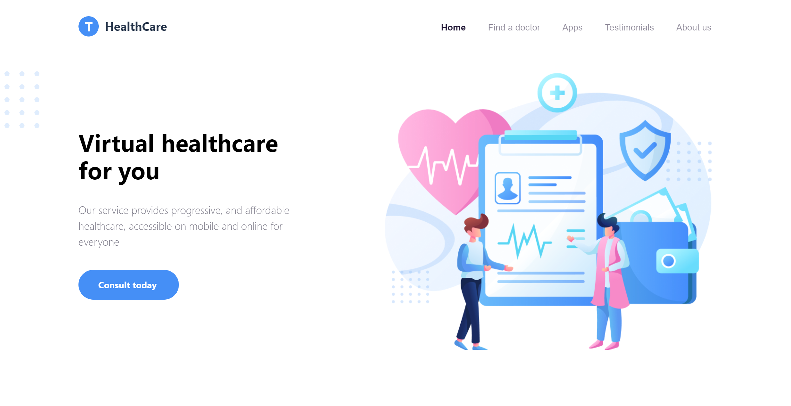
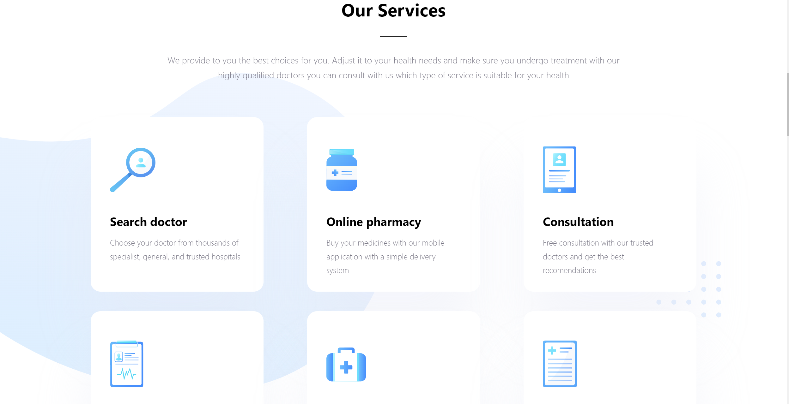
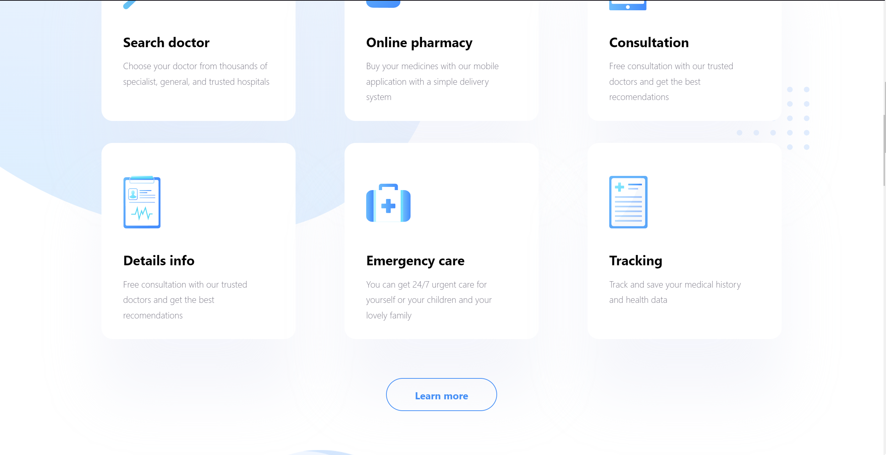
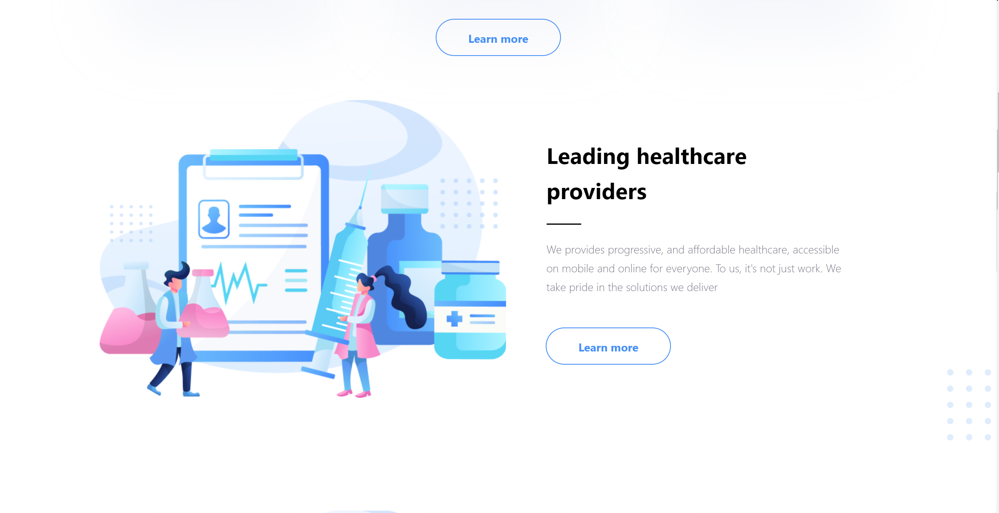
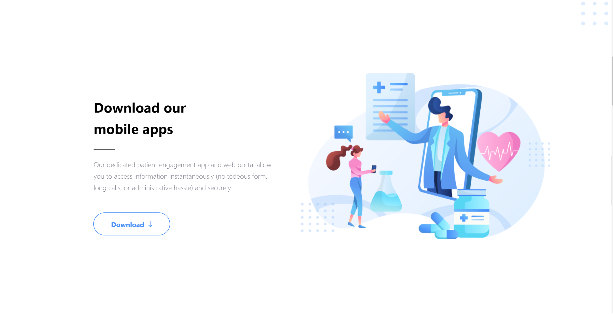
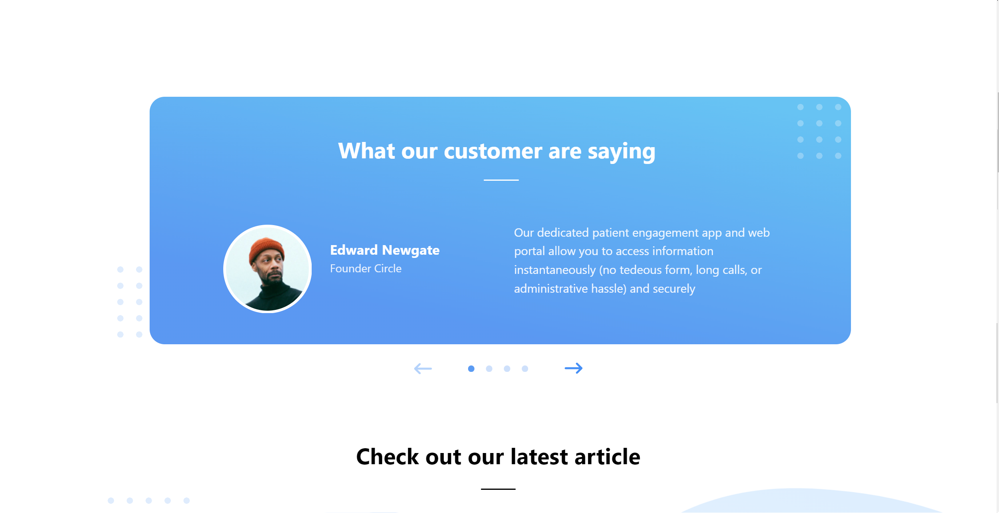
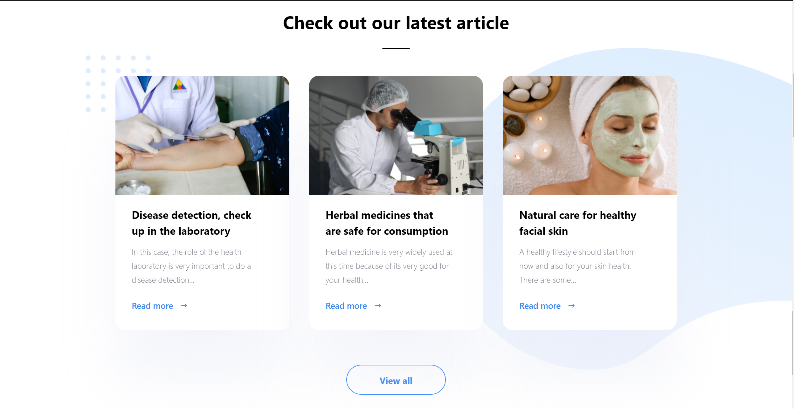
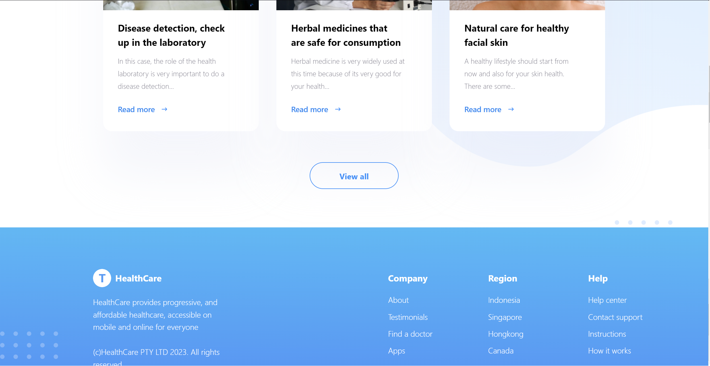

# Digital_Department_React

## Описание проекта
Это проект экрана приложения, написанный на React c использованием TypeScript. На экране присутствуют следующие элементы:

- **Логотип**: Логотип и название сайте.
- **Навигация**: Панель навигации по сайту.
- **Сервисы**: Сервисы предоставляемые сайтом.
- **Отзывы**: Отзывы об услугах сайта.
- **Статьи**: Различные статьи сайта.
- **Нижний колонтитул**: Нижний колонтитул с информацией.
- **Заголовки**: Заголовки всех структур.

## Структура проекта
- **`Article`**: Маленькая карточка с ссылкой на статью.
- **`Articles`**:  Сборник всех статей.
- **`BlockHeader`**: Заголовки структур.
- **`Footer`**: Нижний колонтитул.
- **`HeaderText`**: Текст с различной информацией.
- **`Illustarion`**: Иллюстрации для HeaderText.
- **`Logo`**: Логотип и название сайта.
- **`Review`**: Отзывы о приложении.
- **`Service`**: Маленькая карточка с сервисом.
- **`Services`**: Сборник всех сервисов.
- **`Slider`**: Переключатель отзывов.
- **`TopNav`**: Панель навигации по сайту.

## Технологии
- React, TypeScript, CSS, HTML

## Как использовать
1. Клонируйте репозиторий.
2. Откройте проект в вашей IDE. Желательно в Visual Studio Code.
3. Необходимо зайти в директорию DD при помощи команды *cd DD*
4. Убедитесь, что у вас установлены все необходимые зависимости командой *npm install*.
5. Запустите локальный хост при помощи команды *npm run dev*

## Автор
# Автор: Раевских Максим Игоревич